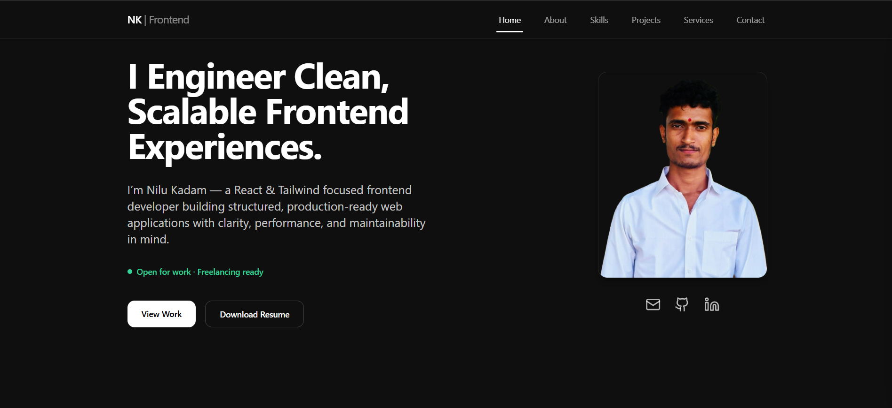

<div align="center">

# Frontend Developer Portfolio

**Production-deployed React portfolio focused on responsive design, reusable components, structured architecture, and modern UI engineering.**

[](https://react.dev/)
[](https://vite.dev/)
[](https://tailwindcss.com/)
[](https://vercel.com/)

### 🌐 Live Demo

https://my-portfolio-lac-nine-cmr0mdy2ds.vercel.app/

</div>

---

<p align="center">
  
</p>

---

# Overview

This portfolio is a production-deployed React application built to present my frontend development work, technical skills, selected projects, and professional services.

The project focuses on building a structured and maintainable frontend application with reusable React components, responsive layouts, client-side routing, subtle animations, and a clear user experience across desktop and mobile devices.

It also serves as a practical example of how I organize, develop, and deploy modern React applications.

---

# What This Project Demonstrates

- React-based frontend development
- Reusable and component-driven UI
- Feature-based project organization
- Responsive design across desktop and mobile
- Client-side routing with React Router
- Context-based application state where required
- Subtle UI animations with Framer Motion
- Responsive styling with Tailwind CSS
- Production deployment with Vercel
- Maintainable and structured frontend code

---

# Features

### Professional Sections

- Hero
- About
- Skills
- Selected Projects
- Services
- Contact

### Engineering Features

- Responsive navigation
- Smooth section navigation
- Client-side routing
- Reusable React components
- Feature-based architecture
- Responsive layouts
- Subtle motion and interaction feedback
- Dedicated project pages
- Resume access
- GitHub and LinkedIn integration
- Email-based contact flow

---

# Technology Stack

| Category | Technology |
|----------|------------|
| Framework | React |
| Build Tool | Vite |
| Styling | Tailwind CSS |
| Animation | Framer Motion |
| Routing | React Router |
| Icons | Lucide React |
| Deployment | Vercel |
| Version Control | Git & GitHub |

---

# Project Architecture

The application follows a feature-based structure that keeps major sections and domain-specific functionality organized independently.

```text
src/
│
├── components/
│   ├── layout/
│   └── motion/
│
├── features/
│   ├── hero/
│   ├── about/
│   ├── skills/
│   ├── services/
│   ├── projects/
│   └── contact/
│
├── assets/
│
├── App.jsx
├── main.jsx
└── index.css